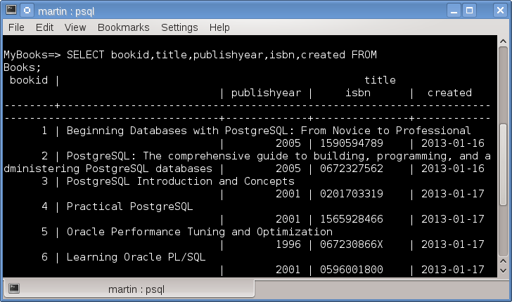
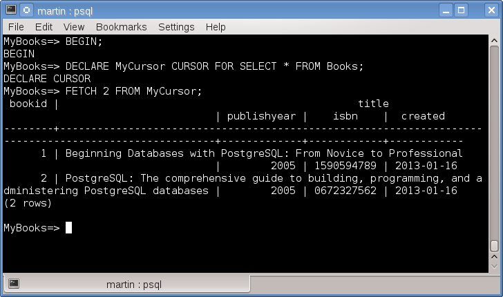
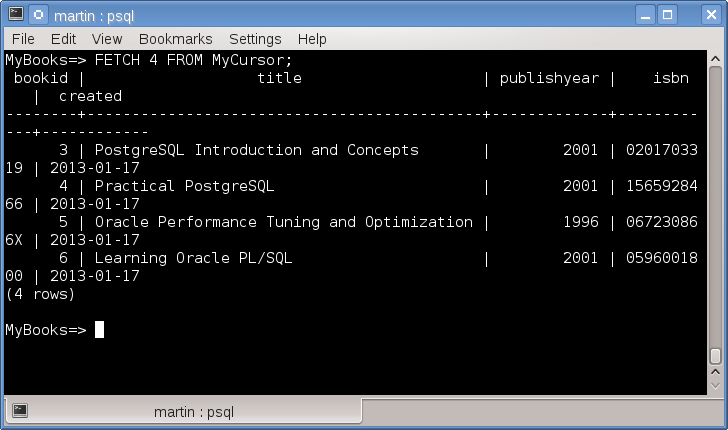
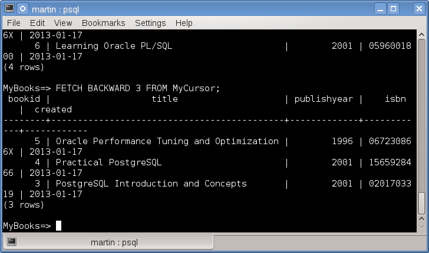
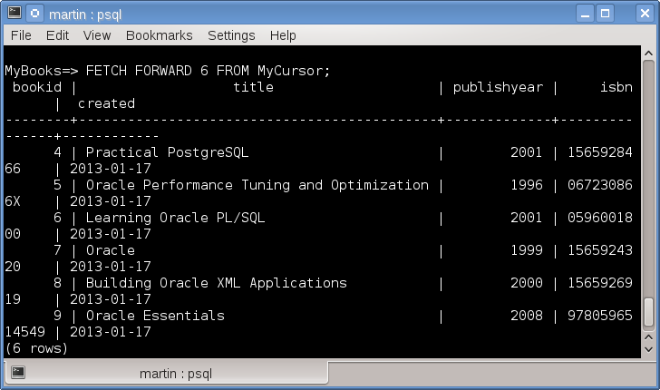
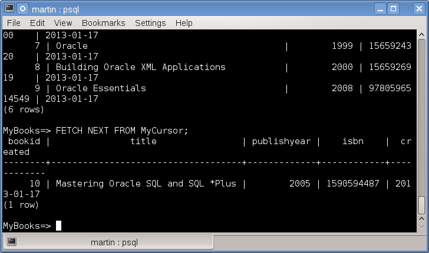
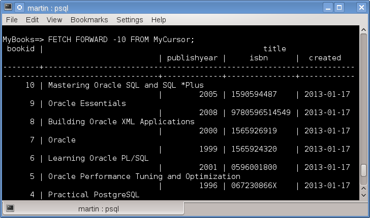
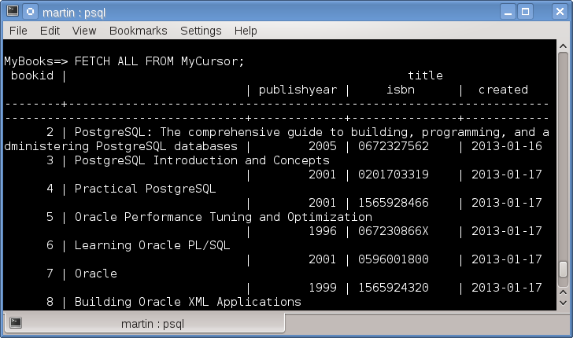
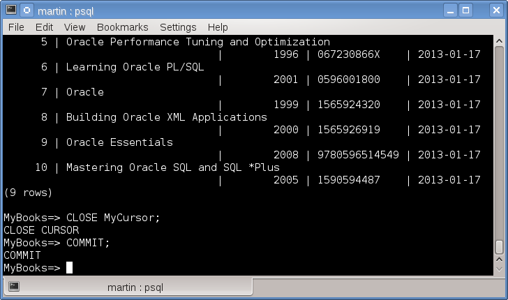

# Entendiendo cursors (cursores) en PostgreSQL.
	

Para el manejo de grandes cantidades de datos tanto en PostgreSQL como en otras bases de datos relacionales existe el concepto de cursors (cursores) los cuales representan un resultset (conjunto de datos) que son asociados a una variable, una variable de tipo cursor. Esta variable representa un apuntador hacia una tabla virtual representada por una consulta y su respectivo comando SELECT asociado.

La diferencia entre un comando SELECT  no asociado a un cursor y uno asociado, es que en el primero la consulta regresará todos los registros a la vez y si queremos limitar la cantidad de registros para procesar debemos correr la consulta nuevamente agregando WHERE, BETWEEN o cualquier otra instrucción para filtrar los resultados. En el caso del comando asociado a un cursor este nos permite desplazarnos y limitar la cantidad de registros para procesar dentro del resultset sin necesidad de un nuevo comando SELECT.

Como ejemplo tenemos una tabla Books dentro de una base de datos llamada <i>MyBooks</i>, aqui esta el script para su creación.
<pre>
CREATE TABLE books
(
  bookid serial NOT NULL,
  title character varying(512),
  publishyear smallint,
  isbn character varying(13),
  created date DEFAULT ('now'::text)::date,
  CONSTRAINT books_pkey PRIMARY KEY (bookid)
)
</pre>
Para mostrar la diferencia entre una consulta sin cursor y una consulta asociada a un cursor, ejecutamos la siguiente consulta.

<pre>
SELECT  bookid, title, publishyear, isbn, created FROM Books.
</pre>

Esta consulta nos devuelve el siguiente resultado.
 

Ahora mostramos los comandos que pueden utilizarse al asociar una consulta a un cursor.
Para el trabajo con cursores es necesario que estos se encuentren dentro del ámbito de una transacción.
Empezamos con una transacción.
<pre>
BEGIN;
</pre>
Declaramos el cursor  como una variable de tipo cursor y le asociamos una consulta SQL.
<pre>
DECLARE mycursor CURSOR FOR SELECT * FROM Books;
</pre>
Ahora podemos navegar entre los registros del resultset, con el comando <b>FETCH</b>, de este comando la sintaxis es:
<pre>
FETCH [FORWARD | BACKWARD |  ALL | NEXT]
</pre>
A continuación unos ejemplos de su utilización.

Obtenemos un par de registros.

<pre>FETCH 2 FROM MyCursor;</pre>
 

Obtenemos los siguientes 4 registros y nos desplazamos:
<pre>
FETCH 4 FROM MyCursor;
</pre> 

Obtenemos 3 registros hacia atrás a partir del último registro.

<pre>
FETCH BACKWARD 3 FROM MyCursor;
</pre> 

Avanzamos de nuevo y obtenemos los próximos 6 registros:

<pre>
FETCH FORWARD 6 FROM MyCursor;
</pre>

Obtenemos el próximo registro
 
<pre>
FETCH NEXT FROM MyCursor;
</pre>

También podemos avanzar de forma negativa con FORWARD -[n] lo que es equivalente a BACKWARD [n].

<pre>
FETCH FORWARD -10 FROM MyCursor;
</pre>

Obtenemos todos los registros del cursor:

<pre>
FETCH ALL FROM MyCursor;
</pre>

Por último cerramos el cursor y confirmamos (o abortamos) la transacción.

<pre>
CLOSE MyCursor;
COMMIT;
</pre>

